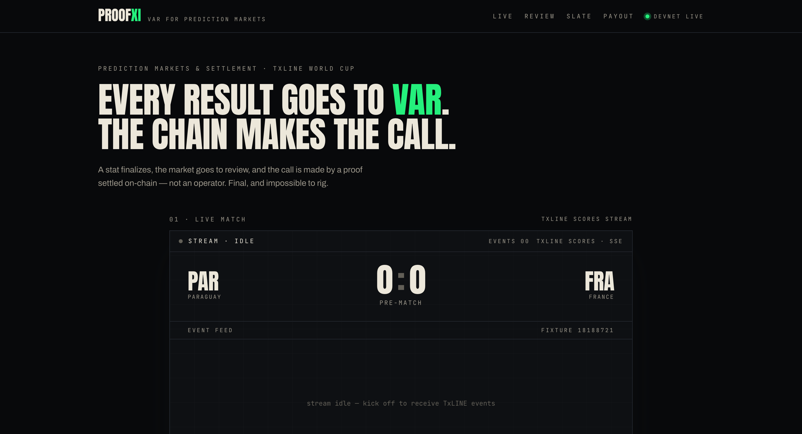
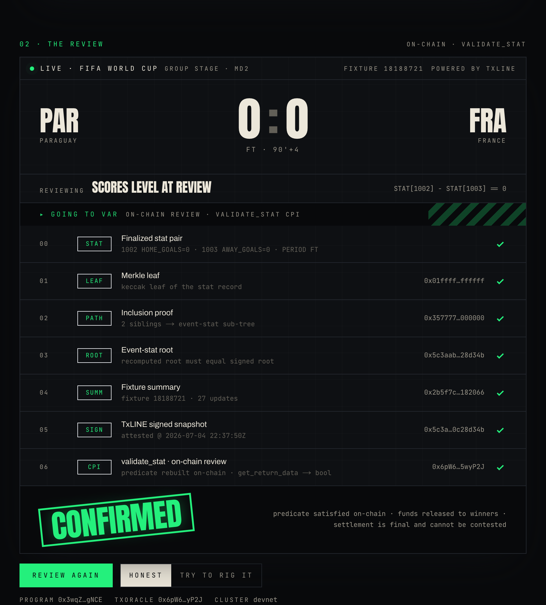
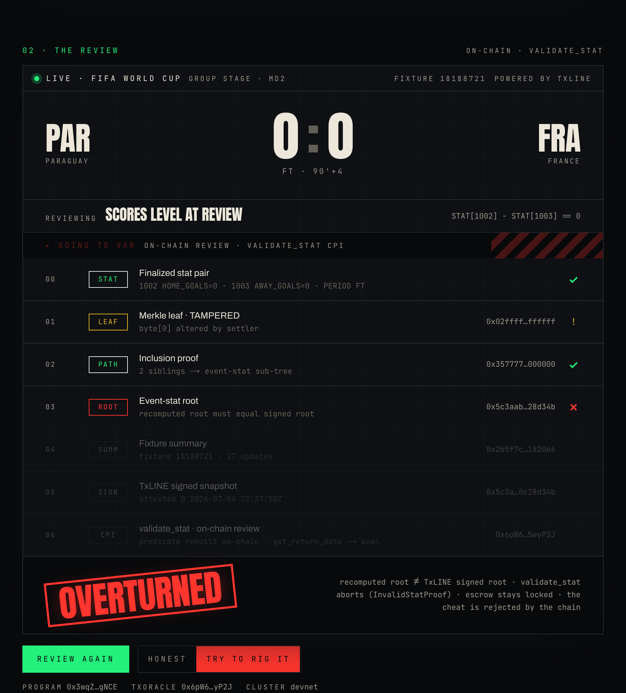
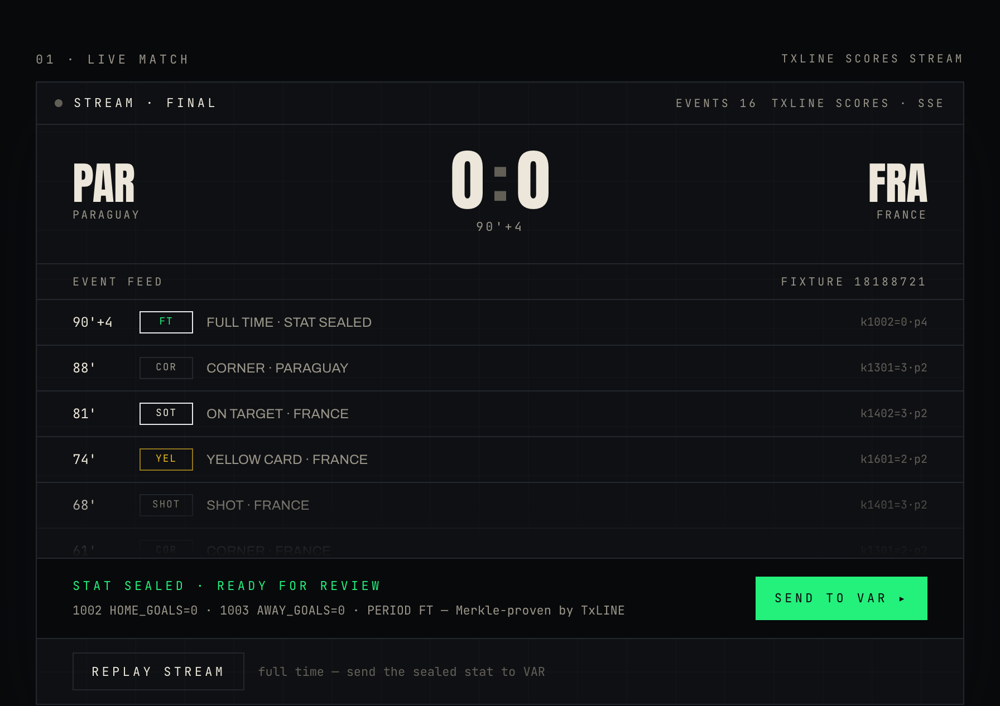
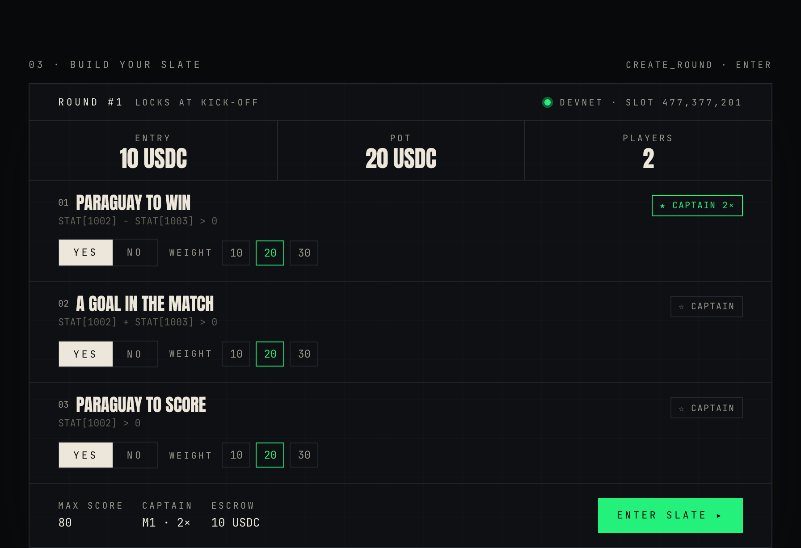
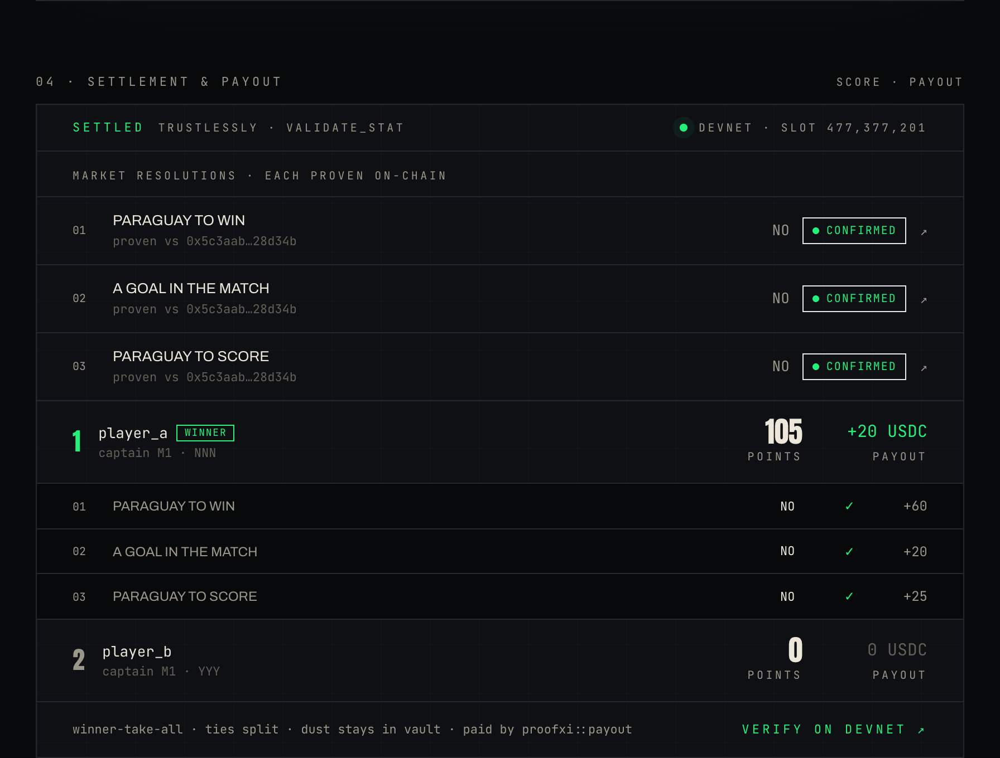

# ProofXI

### VAR for prediction markets — results settled by on-chain proof, not by an operator.



ProofXI is a fantasy World Cup pick'em where the final call on every market is
made by a cryptographic proof settled on Solana — not by a company you have to
trust. A stat finalizes, the market goes to review, and the chain makes the call.
Final, and impossible to rig.

**[Open the live app → proofxi.vercel.app](https://proofxi.vercel.app)** &nbsp;·&nbsp;
[Technical documentation](https://proofxi.vercel.app/docs) &nbsp;·&nbsp; [How it's built](./TECH.md)

Built for the TxODDS World Cup hackathon — *Prediction Markets & Settlement*.

---

## Every prediction market claims "provably fair." ProofXI shows the proof — and shows it rejecting a cheat, live.

Most markets settle behind closed doors: an operator reads a feed and credits the
winners, and you trust that they did it honestly. ProofXI makes the settlement
itself verifiable. Every result is reviewed on-chain against a signed TxLINE
proof, and anyone can watch the review resolve.

### The review — honest vs. rigged

| An honest result is **CONFIRMED** | A tampered one is **OVERTURNED** |
| :--- | :--- |
|  |  |
| The evidence stack checks out — leaf, path, root, signed snapshot — and `validate_stat` returns true. Funds are released to the winners. | Tamper the stat to move the payout and the recomputed root no longer matches TxLINE's signed root. `validate_stat` aborts, the escrow stays locked, the cheat is rejected. |

That is the whole product in one gesture: the *same* flow, run twice. An honest
input confirms; a tampered input is thrown out — by the chain, not by us. No
keeper, no admin, nothing to trust.

---

## How it works

**1 — Real data in.** A live TxLINE scores feed streams over server-sent events
until the match finalizes and the stat is sealed, Merkle-proven by TxLINE.



**2 — Build a slate.** Pick a set of boolean markets, weight them, captain one for
2×, and escrow test-USDC into the round vault. That maps to `proofxi::enter`,
real on devnet.



**3 — Settlement & payout.** Each outcome is proven on-chain via `validate_stat`
and the pot is paid by `proofxi::payout` — winner-take-all, ties split, dust
stays in the vault. Every call carries the proof root it was settled against.



---

## For developers

### Repo layout

```
web/          Next.js frontend — the deployed site
programs/     Anchor programs: proofxi (settlement) + proof_verifier (CPI de-risk)
scripts/      devnet proving scripts (setup, phase3 round, adversarial)
idl/          on-chain IDLs
assets/       README screenshots
```

### Run the site locally

```bash
cd web
npm install
npm run dev        # http://localhost:3000
```

The live match card streams over a real SSE endpoint (`/api/stream`); the slate
builder and leaderboard read the deployed program and test-USDC mint live from
Solana devnet. No environment variables required — the site reads public devnet
state and ships a real TxLINE proof in the bundle.

### Deploy to Vercel

Root directory is `web/` (framework auto-detected as Next.js).

```bash
cd web && npx vercel --prod
```

### Reproduce the on-chain proof (optional)

```bash
npm install                       # root deps (anchor, web3.js, spl-token)
npm run setup                     # TxLINE auth -> subscribe -> pull a real proof
npx tsx scripts/verify-proof.ts   # replay the proof through validate_stat on devnet
npx tsx scripts/phase3.ts         # create_round -> enter -> settle (CPI) -> payout
npx tsx scripts/adversarial.ts    # three cheats, each reverts on devnet
```

---

Solana **devnet** only. The scorelines shown are TxLINE devnet demo data — the
proofs are genuine and verified on-chain; ProofXI proves that settlement
faithfully follows the signed oracle and cannot be tampered, not that the oracle
mirrors any real-world result. Test-USDC is clearly labelled test money. Built
fresh with public libraries, attributed in [`TECH.md`](./TECH.md).
